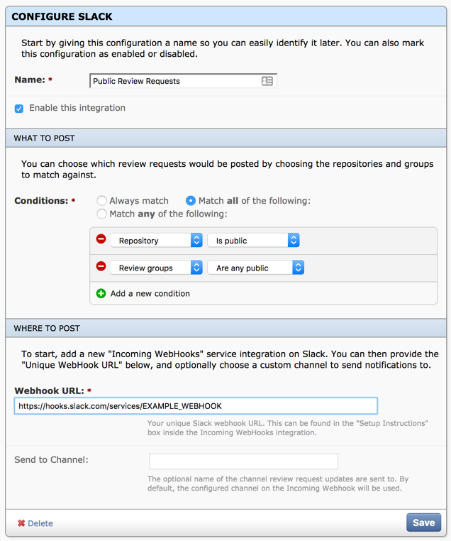

==================================================
Review Board Integrations 0.5 Beta 1 Release Notes
==================================================

**Release date**: TBA

New Features
============

Slack Integration
-----------------

RBIntegrations includes support for integration with `Slack`_, a team
communication service. It can be configured to communicate with one or more
Slack channels, as well as customize what event notifications are sent.

.. figure:: _static/images/0.5/0.5-example-notification.png
   :alt: Example Slack Notification

   An example Slack notification

   An example integration configuration. This configuration only sends
   notifications when changes are made to public review requests.

.. _Slack: https://slack.com

Contributors
============

* Barret Rennie
* Christian Hammond
* David Trowbridge
