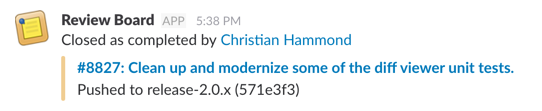

.. default-intersphinx:: rb3.0

==============================
Integrations 0.5 Release Notes
==============================

**Release date**: November 20, 2017

Welcome to the first stable release of the Review Board Integrations
extension. This adds a handful of third-party integrations to Review Board.
It's maintained independently of Review Board, allowing us to supply fixes and
features without requiring an upgrade of Review Board itself.

Review Board 3.0 is required for the integrations 0.5.x releases.

CircleCI Integration
====================

CircleCI_ is a popular continuous integration service used to automatically
build software and run tests to ensure code quality and repeated testing.

Our integration requires CircleCI 2.0, and only works with repositories hosted
on GitHub_ or Bitbucket_. You will need to make manual changes to the
:file:`.circleci/config.yml` in the repository.

:ref:`Learn more <integrations-circle-ci>`

.. _Bitbucket: https://bitbucket.org
.. _CircleCI: https://circleci.com
.. _GitHub: https://github.com

Slack Integration
=================

Slack_ is a popular team communication service used by companies of all sizes.
Our Slack integration can be configured to communicate with one or more Slack
channels, as well as customize what event notifications are sent.

:ref:`Learn more <integrations-slack>`

.. _Slack: https://slack.com

Travis CI Integration
=====================

`Travis CI`_ is a continuous integration service used by both open source
products and companies. It only works with GitHub_ repositories.

Configuration works a bit differently from CircleCI. Due to current
restrictions when working with Travis CI's API, all builds will show up in the
main "Branches" view, which won't differentiate between builds from commits
and builds from Review Board. In order to avoid polluting this for a
production Travis CI project, we recommend creating a branch used solely for
review requests (such as ``review-requests/master`` or
``review-requests/1.0.x``) on the GitHub repository and set that branch in the
Travis CI integration configuration.

The integration will use a custom version of the existing Travis CI
configuration for your repository when performing a build. It will update the
``script`` section to fetch the patch from Review Board, and will update the
``notifications`` section to enable a WebHook for notifying Review Board about
the status of the build. It will also add special environment variables used
as part of the notification process.

:ref:`Learn more <integrations-travis-ci>`

.. _Travis CI: https://travis-ci.com

Contributors
============

* Beth Rennie
* Christian Hammond
* David Trowbridge
